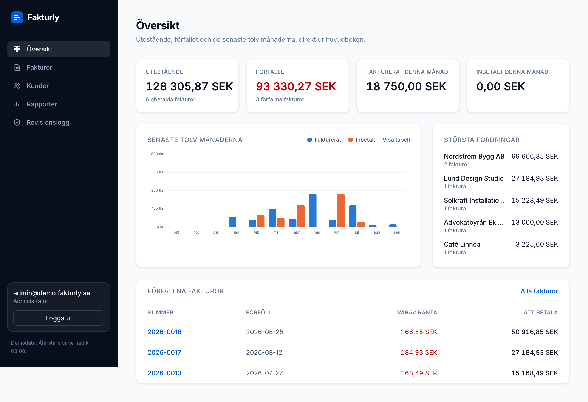
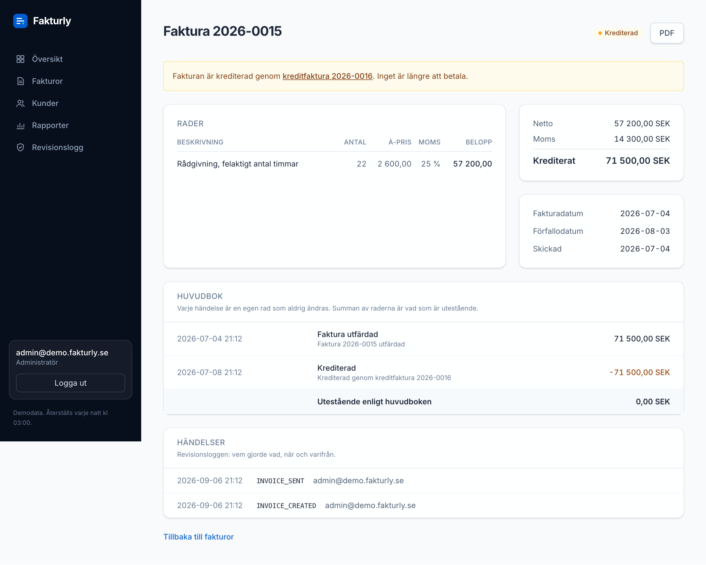
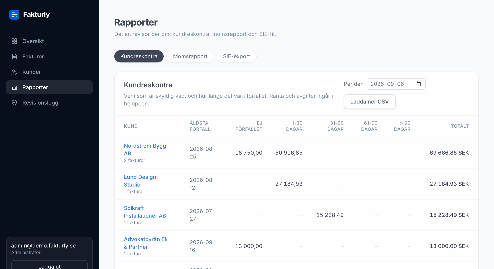
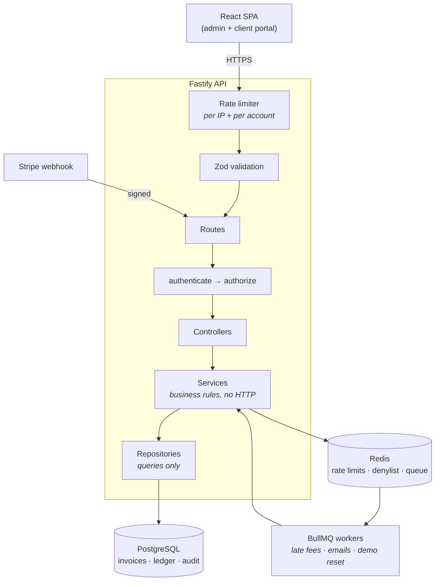

<div align="center">

# Fakturly

**An invoicing and payments system, built to the standards a real financial application is held to.**

Not a CRUD tutorial — every decision is documented with its reasoning and the alternative that was rejected.

[](https://www.typescriptlang.org/)
[](https://bun.sh)
[](https://fastify.dev)
[](https://www.prisma.io)
[](https://www.postgresql.org)
[](https://react.dev)
[](https://github.com/devinder-dev/fakturly/actions/workflows/ci.yml)

**[📐 Architecture decisions](docs/architecture-decisions.md)** · **[🚀 Deployment](docs/deployment.md)** · **[🎤 How to present it](docs/presentation.md)** · **[📖 Auth walkthrough](docs/auth-phase-walkthrough.md)** · **[🔌 Integrations](docs/integrations.md)**

</div>

---

> [!TIP]
> **Live demo: [frontend-ten-pi-74.vercel.app](https://frontend-ten-pi-74.vercel.app)** —
> press *Som administratör* on the landing page. API reference at
> [fakturly-api.onrender.com/docs](https://fakturly-api.onrender.com/docs).
> The dataset resets every night. The API runs on a free tier and takes up
> to a minute to wake after fifteen idle minutes — the first click can be slow.
>
> Or run it locally in three commands (below), or read
> [the ten-minute tour](docs/presentation.md).

## What it is

Two portals over one ledger.

| Admin portal | Client portal |
|---|---|
| Dashboard from the ledger, clients, invoices with VAT per line | Own invoices only — scoped in the query, not the browser |
| Send, remind (statutory fee, once), credit (kreditfaktura), Stripe payment link | Status, amount due with interest, PDF download |
| Kundreskontra, momsrapport, SIE 4 export, CSV | |
| Audit log, per-invoice ledger and event trail | |

Behind them: a nightly job that marks invoices overdue and accrues interest
under **räntelagen**, a Stripe webhook with three layers of idempotency, an
append-only ledger, and an audit log nothing can delete.

<p align="center">
  
</p>

## Why this exists

Most invoicing tutorials get three things wrong that matter enormously in production:

```ts
amount: 99.99                          // floats lose money
await prisma.invoice.update({ ... })   // editing a sent invoice rewrites history
if (!owner) return res.status(403)     // confirms the row exists — enumerates your customers
```

Fakturly gets these right and writes down *why*. All **46 decisions**, each with
the alternative rejected, are in [`docs/architecture-decisions.md`](docs/architecture-decisions.md).

### The four rules it actually follows

**1. Money is never a float.** Every amount is an integer count of öre, named
so the unit is unmistakable — `grossTotalOre`, `lateFeeOre`. VAT is rounded per
line, half away from zero, so a credit note cancels its invoice to the öre.
Conversion to kronor happens once, at the display edge.

**2. Financial history is append-only.** `Transaction` and `AuditLog` rows are
never updated or deleted. A sent invoice is corrected with a **credit note** —
a new document in the same number series — whose ledger rows bring the
original to exactly zero.

<p align="center">
  
</p>

**3. Every auth failure looks identical.** Wrong password, unknown email and
locked account return the same status, the same message, and take the same
time — enforced structurally, by a single error class, so no refactor can
reintroduce the leak. Ownership failures answer 404, never 403.

**4. Idempotency is layered.** Stripe delivers webhooks at least once and
retries for days. The event id is claimed *before* the work, the status guard
lives in the `WHERE` clause, and the reminder fee's "once per debt" is a
column condition — not a check in the service that two clicks can race past.

## Swedish accounting, done properly

| | |
|---|---|
| **Invoice number** | Unbroken series per year, allocated with one atomic `INSERT … ON CONFLICT` — no lost-update race at month end |
| **VAT** | Per line, in basis points, mixed rates on one invoice; net, VAT and gross stated separately as the law requires |
| **PDF** | Every field mervärdesskattelagen lists, VAT per rate, *Godkänd för F-skatt*, bankgiro, and a Luhn-checked **OCR reference** the customer's bank validates before the money leaves |
| **Late interest** | Räntelagen: reference rate + 8 points, per day, one ledger row per accrual — not a flat penalty, which is unenforceable |
| **Reminder fee** | 60 kr under lag (1981:739), once per debt, and only because the terms are printed on the invoice |
| **Credit notes** | Same series, mirror-image lines, original → `CREDITED`, interest and fee written off; a PAID invoice is refused (that is a refund) |
| **Reports** | Kundreskontra with an *as-of* date, momsrapport per rate with credit notes negative, **SIE 4** on the BAS chart in CP437 |
| **CSV** | Semicolons, BOM, CRLF, formulas neutralised — a file Swedish Excel opens correctly |

<p align="center">
  
</p>

## Architecture



**Each layer may only call the one below it.** Services take plain arguments
and never see a request — which is what lets the nightly overdue job, the
demo seed and the API run the exact same code.

## Tested where it can break

| Kind | Count | Against |
|---|---|---|
| Backend integration (`bun test`) | **410** across 28 files | a real PostgreSQL and Redis — transactions that must roll back, unique constraints, an atomic counter under 50 concurrent writers, TTLs expiring |
| Frontend unit (Vitest + Testing Library) | 18 | jsdom, with `fetch` faked and nothing else |
| End to end (Playwright) | 2 | a real browser, the built app, the real API: blank form → sent → PDF → Stripe webhook → PAID, with the ledger read off the screen |

Plus: a test that fails if a route exists without an entry in the
[API reference](docs/screenshots/api-docs.png), a test that fails if a SIE
verification does not balance, and CI that builds the Docker image and refuses
a committed secret.

```bash
cd backend && bun test            # needs docker compose up -d
cd frontend && bun run test       # unit
cd frontend && bun run test:e2e   # needs the demo dataset: cd backend && bun run seed:demo
```

## Quick start

Requires [Bun](https://bun.sh) and Docker.

```bash
git clone https://github.com/devinder-dev/fakturly.git
cd fakturly
docker compose up -d                       # PostgreSQL + Redis

cd backend
cp .env.example .env                       # defaults work locally; Stripe and Resend are stubbed
bun install
bunx prisma migrate deploy
bun run seed:demo                          # a year of invoices, two demo logins
DEMO_MODE=true bun run dev                 # http://localhost:3000, docs at /docs

cd ../frontend
bun install
bun run dev                                # http://localhost:5173
```

Open the landing page and press **Som administratör**. The demo login is
`admin@demo.fakturly.se` / `demo-admin-fakturly-2026`; the client is
`kund@demo.fakturly.se` / `demo-kund-fakturly-2026`.

Deploying to Render + Neon + Vercel is one Blueprint and one page of
instructions: [`docs/deployment.md`](docs/deployment.md).

<details>
<summary><b>Security controls</b> (click)</summary>

| Control | Implementation |
|---|---|
| **Password hashing** | Argon2id, OWASP 2024 params (19 MiB, t=2, p=1) — memory-hard, no bcrypt 72-byte truncation |
| **Password policy** | NIST SP 800-63B — length over complexity, no composition rules, no forced rotation, NFKC-normalised |
| **Breach checking** | HaveIBeenPwned k-anonymity — only 5 characters of a SHA-1 hash ever leave the server |
| **Rate limiting** | Two layers in Redis: per IP (brute force) and per account (distributed attacks) |
| **Anti-enumeration** | Same error, same time, for every auth failure; 404 not 403 for someone else's row |
| **Lockout** | Progressive delays first (0 → 100 ms → 400 ms → 1.6 s), because pure lockout lets anyone lock you out of your own account |
| **Token rotation** | Refresh token reuse revokes the entire token family — replay means it was stolen |
| **Token storage** | SHA-256 for refresh tokens, Argon2id for passwords: *match the hash to the entropy of the input* |
| **Access token** | 15 minutes, in memory in the browser (never localStorage), Redis denylist so logout is real |
| **Input validation** | Zod on every route; `role` is never read from a request body; totals are never accepted, only derived |
| **Webhooks** | Signature verified over the raw bytes; the stub signs with the same HMAC scheme so the check is exercised without an account |
| **Log redaction** | Passwords, `Authorization` and `Cookie` headers can never reach a log line |
| **CSV export** | Leading `=`, `+`, `-`, `@` neutralised — customer-typed text cannot execute in Excel |
| **Error tracking** | Sentry, optional, no PII, only unexpected errors, tagged with the request id the user saw |

</details>

<details>
<summary><b>Tech stack & repository layout</b> (click)</summary>

| Layer | Choice | Why not the alternative |
|---|---|---|
| Runtime | **Bun** | Faster startup and a built-in test runner vs Node |
| API | **Fastify 5** | Real plugin encapsulation; faster than Express |
| Language | **TypeScript** (strict, no `any`) | Catches errors before runtime |
| Database | **PostgreSQL 16** | Relational data fits invoices naturally |
| ORM | **Prisma 7** | Type-safe queries and versioned migrations; one raw query, for `date_trunc` |
| Cache / queue | **Redis 7** + **BullMQ** | Revocable sessions and reliable jobs; bare cron loses failed jobs |
| Hashing | **Argon2id** | Memory-hard; bcrypt is memory-cheap and truncates at 72 bytes |
| Validation | **Zod** | Schema, TypeScript type and OpenAPI document from one definition |
| Payments | **Stripe** | Hosted checkout, webhooks with idempotency |
| PDF | **@react-pdf/renderer** | Flexbox layout; pdfkit is a pen and a table becomes arithmetic |
| Frontend | **React 19 + Vite + Tailwind 4** | TanStack Query for server state; hand-written components, one SVG chart |
| Tests | **bun:test**, **Vitest**, **Playwright** | Each at the boundary it can actually reach |

```
backend/
├── prisma/              schema, migrations, seed and demo seed
└── src/
    ├── lib/             env · prisma · redis · money · ocr · csv · sie · stripe · mailer · sentry
    ├── plugins/         Fastify plugins (db, cache, cors, errors, rate limit)
    ├── middleware/      authenticate · authorize
    ├── validators/      Zod schemas — also the source of the API docs
    ├── routes/          URLs and which protections apply
    ├── controllers/     HTTP in, HTTP out
    ├── services/        business rules — no HTTP knowledge
    ├── repositories/    queries only
    ├── jobs/            BullMQ queues, workers, cron
    ├── pdf/             the invoice document
    ├── docs/            the OpenAPI document
    └── demo/            the showcase dataset — the one file allowed to delete
frontend/
├── src/pages/           landing · login · admin/* · client/* · invoice detail
├── src/components/      ui · BarChart · DemoLogins · RequireAuth · AppLayout
├── src/lib/             api (silent refresh) · auth · types · sentry
└── e2e/                 Playwright
docs/
├── architecture-decisions.md   46 decisions, each with what was rejected
├── deployment.md               Render + Neon + Vercel
├── presentation.md             the ten-minute tour
└── screenshots/
```

</details>

---

<div align="center">

**Devinder Singh** · Fullstack Developer Open Source (YH), Chas Academy, Stockholm

Built as a study in doing financial software correctly.

</div>
