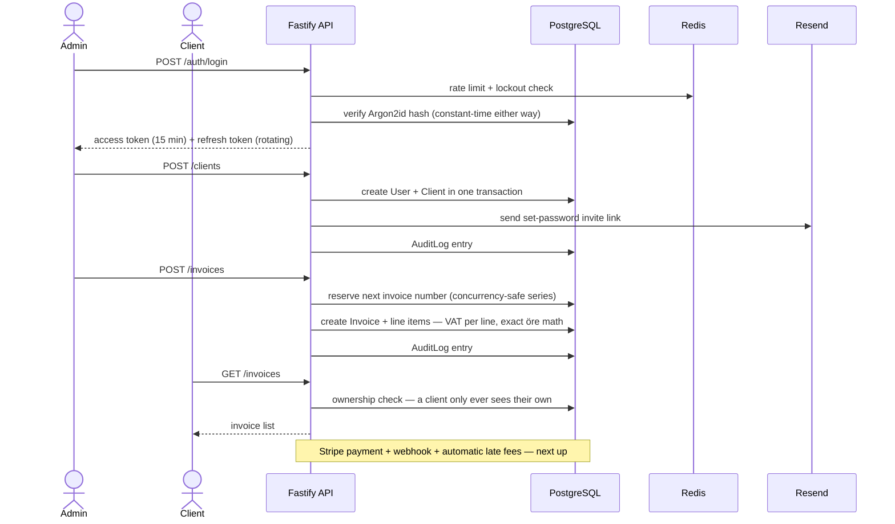
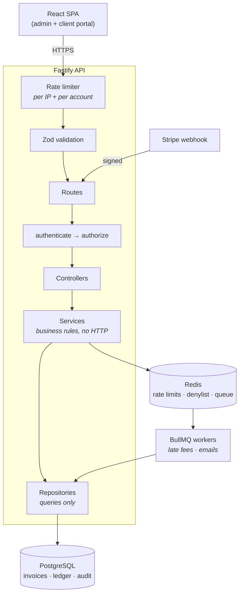

<div align="center">

# Fakturly

**An invoicing and payments system, built to the standards a real financial application is held to.**

Not a CRUD tutorial — every decision is documented with its reasoning and the alternative that was rejected.

[](https://www.typescriptlang.org/)
[](https://bun.sh)
[](https://fastify.dev)
[](https://www.prisma.io)
[](https://www.postgresql.org)
[](https://redis.io)
[](https://github.com/devinder-dev/fakturly/actions/workflows/ci.yml)

**[📐 Architecture Decision Record](docs/architecture-decisions.md)** · **[📖 Auth walkthrough](docs/auth-phase-walkthrough.md)** · **[🔌 Integrations](docs/integrations.md)**

</div>

---

> [!NOTE]
> **Actively being built.** Auth and invoicing are done and tested — an admin
> can provision a customer, issue a VAT-correct invoice, and the customer sees
> only their own, Stripe payments settle invoices, and overdue interest
> accrues nightly. The frontend is next. See
> **[Status](#-status)** — no feature is claimed here before it runs.

## Why this exists

Most invoicing tutorials get three things wrong that matter enormously in production:

```ts
amount: 99.99                          // floats lose money
await prisma.invoice.delete({ ... })   // deleted ledger rows break audits
if (!user) return res.status(404)      // leaks your entire customer list
```

Fakturly is an attempt to get these right — and to understand *why* each rule
exists. All 28 decisions, and the alternative rejected for each, are in
[`docs/architecture-decisions.md`](docs/architecture-decisions.md).

## How it works

The flow below is what's actually implemented today — admin login through
invoice creation. Payment collection is the next piece being built.



## Architecture



**Each layer may only call the one below it.** Services take plain arguments
and never touch `request` — which is what lets the (upcoming) overdue-invoice
job reuse the exact same business logic from a BullMQ worker, where no HTTP
request exists.

## 📊 Status

| Component | State |
|---|---|
| Docker: PostgreSQL 16 + Redis 7, health-checked | ✅ |
| Fastify app, fail-fast env validation, graceful shutdown | ✅ |
| Prisma schema — users, clients, invoices, immutable ledger, audit log | ✅ |
| Input validation, breach checking, two-layer rate limiting | ✅ |
| Argon2id hashing, login / refresh / logout with token rotation + theft detection | ✅ |
| `authenticate` / `authorize` middleware, Redis denylist, audit logging | ✅ |
| Admin seed + atomic client provisioning | ✅ |
| Client CRUD with ownership (IDOR) checks | ✅ |
| VAT per line item, mixed rates, exact öre arithmetic | ✅ |
| Invoice numbering — unbroken series, concurrency-safe | ✅ |
| Invoice creation, reads, send, immutable ledger | ✅ |
| CI: typecheck, migrations, full suite on every push | ✅ |
| Set-password invite email, single-use expiring tokens | ✅ |
| Stripe Checkout + webhook, three layers of idempotency | ✅ |
| Statutory late fees (räntelagen), daily accrual | ✅ |
| BullMQ workers + cron scheduler, retries and backoff | ✅ |
| React frontend, PDF invoices | ⏳ next |

**312 tests / 657 assertions** pass across 17 suites, zero failures, in CI
against a real PostgreSQL and Redis on every push — including a measured
timing-attack defence, a forced transaction rollback leaving neither row, a
refresh-token replay triggering family-wide revocation, and 50 concurrent
invoice numbers forming an unbroken series.

```bash
cd backend && bun test
```

## Quick start

Requires [Bun](https://bun.sh) and Docker.

```bash
git clone https://github.com/devinder-dev/fakturly.git
cd fakturly

docker compose up -d              # PostgreSQL + Redis

cd backend
cp .env.example .env              # then fill in the values
bun install
bunx prisma migrate deploy
bun run dev                       # http://localhost:3000
```

```bash
curl localhost:3000/health/ready
# {"status":"ready","database":"up","redis":"up"}
```

<details>
<summary><b>The reasoning behind the code</b> — four principles it actually follows (click)</summary>

### 1. Money is never a float

Every amount is an integer count of *öre* (1 SEK = 100 öre), named so the unit
is unmistakable: `amountOre`, `unitPriceOre`, `lateFeeOre`. Conversion happens
only at the display edge, never in business logic.

```ts
amount: 9999   // 99.99 SEK, exact, always — never 99.99 as a float
```

### 2. Financial history is append-only

`Transaction` and `AuditLog` rows are never updated or deleted. A correction
is a **new** row with a negative amount — if a row can be edited, history is
not evidence.

```ts
await prisma.transaction.create({
  type: 'ADJUSTMENT',
  amountOre: -500,
  description: 'Rättelse för faktura #123'
})
```

### 3. Every auth failure looks identical

Wrong password, unknown email, and locked account return the same status, the
same message, and take the same amount of time — enforced *structurally*, so
no future refactor can accidentally reintroduce the leak.

### 4. Errors never leak internals

Prisma's own message is `Unique constraint failed on the fields: (email)` —
returning that confirms an address is registered. One central handler logs
everything and returns the minimum:

```jsonc
{ "error": { "code": "CONFLICT", "message": "Resursen kunde inte skapas", "requestId": "req-42" } }
```

</details>

<details>
<summary><b>Security controls</b> (click)</summary>

| Control | Implementation |
|---|---|
| **Password hashing** | Argon2id, OWASP 2024 params (19 MiB, t=2, p=1) — memory-hard, no bcrypt 72-byte truncation |
| **Password policy** | NIST SP 800-63B — length over complexity, no composition rules, no forced rotation, NFKC-normalised |
| **Breach checking** | HaveIBeenPwned k-anonymity — only 5 characters of a SHA-1 hash ever leave the server |
| **Rate limiting** | Two layers in Redis: per IP (brute force) and per account (distributed attacks) |
| **Anti-enumeration** | Attempts counted for addresses that *don't exist*, so response timing reveals nothing |
| **Lockout** | Progressive delays first (0 → 100ms → 400ms → 1.6s), because pure lockout lets anyone lock you out of your own account |
| **Token rotation** | Refresh token reuse revokes the entire token family — replay means it was stolen |
| **Token storage** | SHA-256 for refresh tokens, Argon2id for passwords: *match the hash to the entropy of the input* |
| **Input validation** | Zod on every route; `role` is never read from a request body |
| **Log redaction** | Passwords, `Authorization` and `Cookie` headers can never reach a log line |

**Why breach checking beats complexity rules:** "must contain uppercase, a
number and a symbol" reliably produces `Password1!` — it *reduces* real
entropy by pushing everyone into the same predictable pattern. Checking
against ~1 billion known-breached passwords catches far more real attacks,
without the password ever leaving the server:

```
SHA-1("password") = 5BAA61E4C9B93F3F0682250B6CF8331B7EE68FD8
                    └─5─┘
send only "5BAA6"  →  HIBP returns ~800 candidate suffixes  →  match locally
```

HIBP sees a prefix matching hundreds of passwords — it cannot tell which one
was ours. In testing, `password` came back with **52,372,427** hits.

</details>

<details>
<summary><b>Tech stack & repository layout</b> (click)</summary>

| Layer | Choice | Why not the alternative |
|---|---|---|
| Runtime | **Bun** | Faster startup and a built-in test runner vs Node |
| API | **Fastify 5** | Real plugin encapsulation; faster than Express |
| Language | **TypeScript** (strict, no `any`) | Catches errors before runtime |
| Database | **PostgreSQL 16** | Relational data fits invoices naturally |
| ORM | **Prisma 7** | Type-safe queries and versioned migrations |
| Cache / queue | **Redis 7** | Revocable sessions and reliable job queues |
| Hashing | **Argon2id** | Memory-hard; bcrypt is memory-cheap and truncates at 72 bytes |
| Validation | **Zod** | Schema and TypeScript type from one definition |
| Payments | **Stripe** | Webhooks with idempotency |
| Jobs | **BullMQ** + node-cron | Retries and visibility; bare cron loses failed jobs |

Full reasoning for each: [`docs/architecture-decisions.md`](docs/architecture-decisions.md)

```
backend/
├── prisma/              schema + migrations
└── src/
    ├── lib/             env · prisma · redis · errors · external clients
    ├── plugins/         Fastify plugins (db, cache, errors, rate limit)
    ├── validators/      Zod schemas
    ├── services/        business logic — no HTTP knowledge
    ├── routes/          URLs and middleware
    └── types/           shared TypeScript types
docs/
└── architecture-decisions.md
```

| Script | Does |
|---|---|
| `bun run dev` | Dev server with watch mode |
| `bun run start` | Run once |
| `bun run typecheck` | `tsc --noEmit` |

</details>

---

<div align="center">

**Devinder Singh** · Fullstack Developer (YH) student at Chas Academy, Stockholm

Built as a study in doing financial software correctly.

</div>
