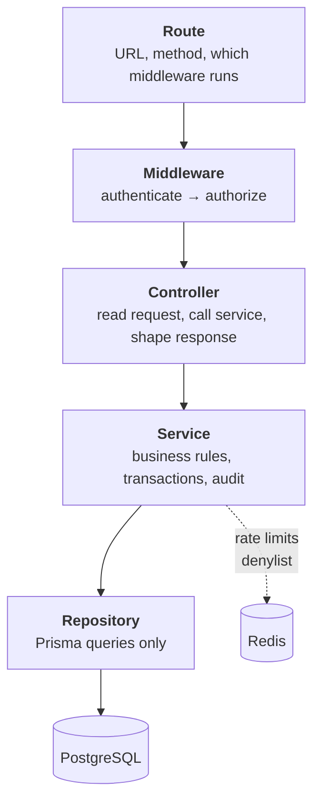
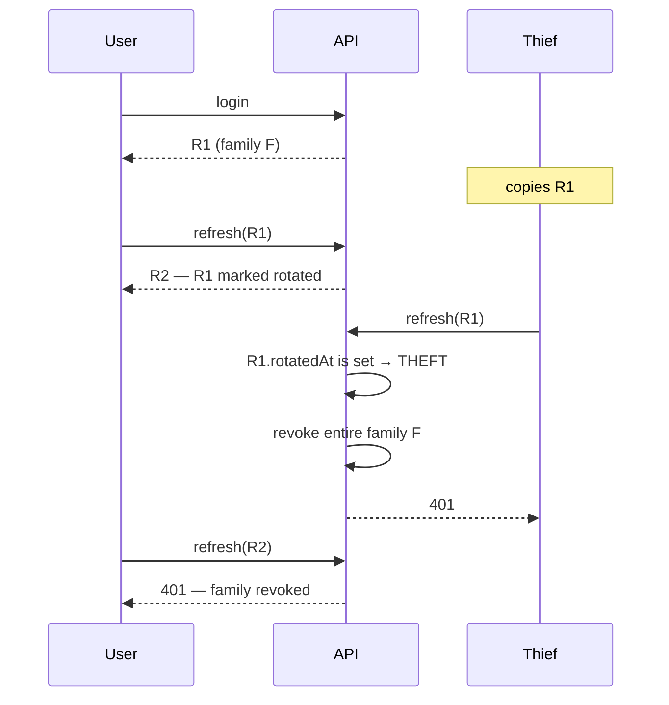
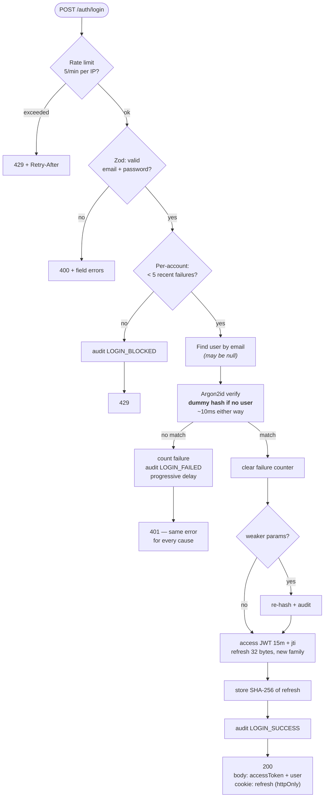
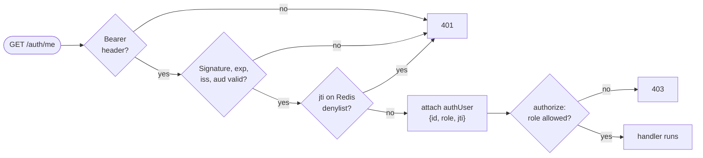
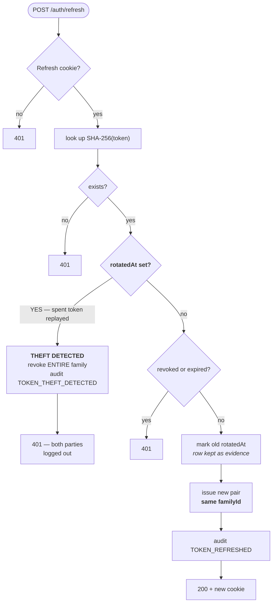
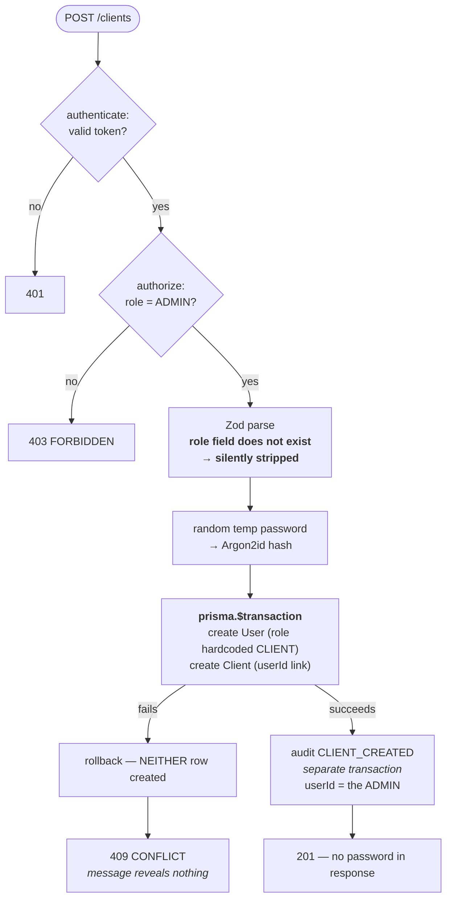

# Fakturly — Authentication Phase: Complete Walkthrough

Everything built in the auth phase, why each piece exists, and how it all
connects. Written to be re-read months later, and to be explainable to someone
else out loud.

**Two ways to read this:**

- **[Part 1–4](#part-1--the-big-picture)** — the full technical account
- **[Part 6](#part-6--every-step-in-plain-english)** — the same thing in plain English, no jargon

---

## Contents

| | |
|---|---|
| [Part 1](#part-1--the-big-picture) | The big picture |
| [Part 2](#part-2--the-steps) | The steps, 0 → 8 |
| [Part 3](#part-3--complete-request-flows) | Complete request flows |
| [Part 4](#part-4--the-file-map) | Every file and its job |
| [Part 5](#part-5--the-security-properties) | The security properties, and how each is tested |
| [Part 6](#part-6--every-step-in-plain-english) | **Plain English version** |
| [Part 7](#part-7--what-is-not-done) | What is deliberately not done |
| [Part 8](#part-8--verify-it-yourself) | Verify it yourself |

---

# Part 1 — The big picture

## What exists after this phase

A working authentication system: an admin can log in, stay logged in securely
for 30 days, provision customer accounts, and log out in a way that actually
ends the session. Every security-relevant event is permanently recorded.

**183 automated assertions** across seven suites verify it.

## The layers



**Each layer may only call the one below it.** The rule that makes this pay
off: a **service never sees `request` or `reply`**. It takes plain arguments
and returns plain data.

Why that matters concretely — the overdue-invoice job in Week 3 runs from a
BullMQ worker where no HTTP request exists. A service that called
`reply.code(401)` simply could not be reused there. Keeping services
HTTP-agnostic is what lets the same logic serve an API route, a background
job, and a test.

## The two-token model

| | Access token | Refresh token |
|---|---|---|
| **Lifetime** | 15 minutes | 30 days |
| **Format** | JWT — self-describing | 32 random bytes — meaningless |
| **Verified how** | Signature only, no DB | Database lookup, every time |
| **Stored client-side** | Memory (response body) | httpOnly cookie |
| **Stored server-side** | Nothing | SHA-256 hash only |
| **Revocable** | Via Redis denylist | Yes, immediately |

One token forces an impossible choice: short means constant re-logins, long
means a stolen token works for weeks. Two tokens split the job — the **fast**
one is short-lived, the **revocable** one is checked against the database.

---

# Part 2 — The steps

## Step 0 — Schema migration

**Problem found:** the original `AuditLog.userId` was a required foreign key.

A failed login for an email that does not exist has **no user to point at**.
So the single most security-relevant event in the system — someone testing
leaked passwords against addresses that were never registered — was
*impossible to record*.

**Changes:**

```prisma
model AuditLog {
  userId String?   // was: String (required)
  email  String?   // NEW: what was attempted, when no user matched
  @@index([userId, createdAt])
  @@index([action, createdAt])   // "all failed logins in the last hour"
  @@index([email, createdAt])    // "is this address under attack?"
}

model RefreshToken {          // NEW
  tokenHash   String @unique  // SHA-256 — never the token itself
  familyId    String          // one login = one family
  rotatedAt   DateTime?       // set when spent — this is the theft evidence
  revokedAt   DateTime?
  createdByIp String?         // forensics
}
```

Also decided here: **Argon2id replaces bcrypt** (memory-hard, no silent
72-byte truncation).

---

## Step 1 — Input validation + breach checking

### Two password schemas, deliberately

```ts
loginPasswordSchema   min(1)   max(1024)   // shape only
newPasswordSchema     min(12)  max(128)    // policy, + NFKC
```

Enforcing `min(12)` at **login** would be two bugs at once:

1. **It leaks the policy.** "At least 12 characters" tells an attacker to skip
   everything shorter.
2. **It locks out real users.** Raise the minimum to 14 later and every
   existing user with a 12-character password is refused at *login* — not
   asked to update, just refused.

### NIST SP 800-63B — the rules invert common sense

| Rule | Why |
|---|---|
| Length over complexity | 41 characters of ordinary words beats `Passw0rd!` |
| **No** composition rules | "Upper + digit + symbol" reliably produces `Sommar2026!` — it *lowers* real entropy |
| **No** forced rotation | Produces `Summer2026` → `Summer2027` |
| Max **not below** 64 | Passphrases must work |
| Check breach lists | Catches far more real attacks than any complexity rule |

### HIBP k-anonymity

Checking against ~1 billion leaked passwords, without the password ever
leaving our server:

```
SHA-1("password") = 5BAA61E4C9B93F3F0682250B6CF8331B7EE68FD8
                    └─5─┘└──────────── 35 ────────────────┘

send  "5BAA6"  →  HIBP returns ~800 candidate suffixes
                  we match locally
```

HIBP sees a prefix matching hundreds of different passwords. It cannot tell
which was ours. Verified live: `password` returns **52,372,427** hits.

`Add-Padding: true` matters — without it the *size* of the response leaks
roughly how many breached passwords share the prefix.

**Fails open.** If HIBP is down we allow the password and report
`checkFailed`. Failing closed would mean nobody can set a password during a
third-party outage — outsourcing our own availability.

---

## Step 1b — Errors

`SERVICES THROW · ONE PLACE TRANSLATES`

| Source | What the client gets |
|---|---|
| Our domain errors | The real reason — it's their action |
| Zod | Field-level details — it's their own input |
| **Prisma** | **Status code only, message discarded** |
| Fastify 4xx | Passed through, harmless |
| Anything else | Bare 500 in production |

The Prisma row is the one that matters. Prisma says
`Unique constraint failed on the fields: (email)` — forward that and you have
just confirmed the address is registered. Enumeration through a different door.

Every response shares one shape with a `requestId`, so a user can quote
`req-42` and the log line is one grep away.

---

## Step 2 — Two-layer rate limiting

Neither layer is redundant; **each covers what the other is blind to**:

| Attack | Shape | Per-IP | Per-account |
|---|---|---|---|
| Brute force | 1 account, 1000 passwords, 1 IP | ✅ | ✅ |
| Distributed brute force | 1 account, 1000 passwords, 500 IPs | ❌ | ✅ |
| Spraying | 50 000 accounts, 1 password, 1 IP | ✅ | ❌ |
| Distributed spraying | 50 000 accounts, 1 password, 500 IPs | ❌ | ❌ |

The bottom row defeats both — and is stopped by **Step 1's breach checking**,
because spraying only works with passwords people actually use.

### Why Redis, not memory

```
3 instances, in-memory  →  attacker gets 15/min under a "5/min" limit
3 instances, Redis      →  attacker gets 5/min
```

The limit silently becomes *your number × instance count*. Nothing errors.

### The enumeration trap

We count attempts for **every submitted address, including ones that do not
exist**. Counting only real accounts would make known addresses progressively
slower while unknown ones stayed instant — reintroducing the exact timing
oracle Step 1 removed.

Keys hold `SHA-256(email)`, so customer addresses are not scattered across
Redis.

### Progressive delay before lockout

```
attempt 1-2   0 ms      typos shouldn't be punished
attempt 3     100 ms
attempt 4     400 ms
attempt 5     lockout, 15 minutes
```

Pure lockout is a **self-inflicted denial of service** — anyone can lock you
out of your own account by failing five times on purpose. The delay makes
brute force impractical long before lockout is reached.

### Known limitation: fixed window

The counter is one number with a TTL, not a history. A client can spend its
full quota just before the reset and again just after — **up to 2× the limit
across that boundary**. Demonstrated: 6 requests in 343 ms under a
"3 per 3 seconds" rule.

Acceptable here because the per-account limiter and progressive delay still
apply to every individual attempt. It would **not** be acceptable in front of
something that costs money per call, like sending an SMS.

---

## Step 3 — Argon2id password hashing

```ts
memoryCost: 19456   // 19 MiB per hash attempt
timeCost:   2
parallelism: 1
```

**`memoryCost` is the one that matters.** A GPU has thousands of cores but
little fast memory *per core*. Forcing 19 MiB per guess means the card runs
out of memory long before it runs out of compute. bcrypt is CPU-hard but
memory-cheap, so it parallelises far better for an attacker.

### The salt is inside the hash

```
$argon2id$v=19$m=19456,t=2,p=1$c29tZXNhbHQ$RdescudvJCsgt3ub+b+dWRWJTmaaJObG
└ algo ──┘└v┘└─ parameters ──┘└─ salt ──┘└──────── hash ─────────┘
```

No salt column, by design. It also lets us detect old hashes and upgrade them
on the next successful login — the only moment we hold the plaintext.

### The timing attack — measured

| Path | Time |
|---|---|
| User exists, wrong password | 10.2 ms |
| User missing, dummy verify | 10.3 ms |
| Naive early return (the bug) | 0.000 ms |

**1.01× apart.** When there is no user we verify against a throwaway hash
anyway. That deliberate waste *is* the security control — without it, someone
submits 100 000 addresses, times the responses, and reads off your customer
list.

### NFKC normalisation lives in the service, not the validator

`é` can be one codepoint or `e` + a combining accent. Identical on screen,
completely different bytes. If normalisation happened only when *setting* a
password, someone could set it on their laptop and be **unable to log in from
their phone** — presenting as "sometimes my password just stops working".

Putting it in the service gives one choke point that applies to hashing **and**
verifying. Both round-trip directions are tested.

---

## Step 4 — Login, refresh, logout

### Rotation with reuse detection

Every refresh **spends** the token it was given: the row is marked `rotatedAt`
(never deleted) and a new token is issued in the same family.

A legitimate client therefore *never* presents a spent token. So when one
arrives, two copies exist — and one was stolen.



Both parties are logged out. That is the correct outcome: we cannot tell thief
from victim, the attacker loses access within minutes, and the user finds out
something happened. Without rotation, a stolen refresh token works silently for
30 days.

**The rotated row is marked, never deleted.** Delete it and a replayed token
looks merely *unknown* — indistinguishable from a typo — and the theft goes
unnoticed. The row **is** the evidence.

### Where each token lives

```
Refresh → httpOnly, secure, sameSite=strict, path=/auth
          XSS cannot read it. CSRF cannot use it.

Access  → response body, held in memory
          Never sent automatically, so it cannot be used in CSRF.
```

### One JWT detail worth remembering

```ts
algorithms: ['HS256']   // pinned
```

A verifier that trusts the token's *own* header can be handed `alg: "none"` —
an unsigned token that verifies fine. Classic, still-exploited JWT bug.

---

## Step 5 — Middleware

```
authenticate  →  "who are you?"   →  401 if we cannot tell
authorize     →  "may you?"       →  403 if you may not
```

Getting these backwards matters: a client seeing 401 should refresh its token;
on 403 refreshing is pointless and loops forever.

Runs on `onRequest`, not `preHandler` — an unauthenticated request is refused
**before Fastify parses its body**.

### The denylist is what makes logout real

```
GET /auth/me  with token X  → 200 ✅
POST /auth/logout
GET /auth/me  with token X  → 401 ❌
```

Same token both times. It is still **cryptographically valid** — correct
signature, not expired. Only the Redis denylist stops it.

The TTL is the elegant part: set to the token's remaining lifetime, so the
entry evicts itself exactly when the token would have expired anyway. The
denylist can never grow unbounded and needs no cleanup job.

### `authorize` fails closed

If `authUser` is missing, the route was wired without `authenticate` — a bug.
The tempting response is a loud 500 to surface it. We **deny** instead: a
misconfiguration then presents as "nobody can access this", which is noticed in
minutes and harms nobody, rather than an outage.

### Roles are not hierarchical

An `ADMIN` hitting a `CLIENT`-only route gets **403**. Hierarchy should be an
explicit decision, not inherited by accident.

---

## Step 6 — Audit logging

Two rules:

1. **Never shares a transaction** with the operation it records. A rollback
   must not erase the evidence — for a failed login that would delete exactly
   the record you need.
2. **Never fails the user's operation.** A logging hiccup must not stop a
   customer logging in.

Rule 2 is a stated trade-off. Some regulated systems do the opposite — if it
cannot be logged, it must not happen. Defensible for money movement;
for authentication it would mean a logging glitch locks every customer out.

**Eight actions recorded:** `LOGIN_SUCCESS`, `LOGIN_FAILED`,
`LOGIN_BLOCKED_RATE_LIMIT`, `LOGOUT`, `TOKEN_REFRESHED`,
`TOKEN_THEFT_DETECTED`, `PASSWORD_REHASHED`, `CLIENT_CREATED`.

The one that justifies the Step 0 migration:

```
LOGIN_FAILED   userId: null   email: "aldrig-funnits@ingenstans.se"
```

A burst of those is what credential stuffing looks like. The original schema
could not store them at all.

---

## Step 7 — Provisioning and the seed

### No public registration

Users are created by an admin, as in every real invoicing and banking system.
You do not sign yourself up as a customer of someone's accounts-receivable
ledger.

### Both rows, or neither

```ts
prisma.$transaction(async (tx) => {
  const user = await tx.user.create({ role: 'CLIENT' })   // hardcoded
  await tx.client.create({ userId: user.id, ... })
})
```

`Client.userId` is required and unique. A half-completed create leaves a user
who **can log in, has no client record, sees an empty portal, and whose email
is now taken so the admin cannot even retry.**

Verified by forcing a duplicate-email failure and asserting **neither** row
survives.

### The temporary password is never returned

Random, hashed with the same parameters as any real password, and never shown.
Returning it would put a working credential in browser history, proxy logs and
screen recordings.

### The seed script

The only place in the codebase that sets `role: 'ADMIN'`. Nothing reachable
over HTTP can produce one. It runs the same validation and breach check as any
password — verified that it rejects short and breached passwords, and is
idempotent.

---

## Step 8 — End-to-end verification

43 assertions covering seed → login → protected route → provisioning →
escalation attempt → rollback → role refusal → failed-login auditing →
rotation → theft detection → logout.

---

# Part 3 — Complete request flows

## Login



**Note the order:** the rate-limit check happens *before* the database lookup,
so a flood of guesses cannot become a flood of queries.

## Protected request



## Refresh with theft detection



## Client provisioning



---

# Part 4 — The file map

## Configuration and connections

| File | Job |
|---|---|
| [`lib/env.ts`](../backend/src/lib/env.ts) | Validates every env var at boot. Bad config → process refuses to start |
| [`lib/prisma.ts`](../backend/src/lib/prisma.ts) | One PrismaClient for the process. A client per request would exhaust Postgres |
| [`lib/redis.ts`](../backend/src/lib/redis.ts) | One ioredis connection, capped retry backoff |
| [`plugins/prisma.ts`](../backend/src/plugins/prisma.ts) | Exposes `app.prisma` app-wide via `fastify-plugin` |
| [`plugins/redis.ts`](../backend/src/plugins/redis.ts) | Exposes `app.redis` |
| [`app.ts`](../backend/src/app.ts) | Builds the app. **async** — see the trap below |
| [`server.ts`](../backend/src/server.ts) | Starts it; graceful shutdown on SIGINT/SIGTERM |

## Security

| File | Job |
|---|---|
| [`lib/errors.ts`](../backend/src/lib/errors.ts) | 9 typed domain errors. `AccountLockedError` is externally identical to `InvalidCredentialsError` |
| [`plugins/errorHandler.ts`](../backend/src/plugins/errorHandler.ts) | The single translation point. Prisma messages never reach a client |
| [`lib/hibp.ts`](../backend/src/lib/hibp.ts) | Breach checking via k-anonymity |
| [`plugins/rateLimit.ts`](../backend/src/plugins/rateLimit.ts) | Layer 1 — per IP, Redis-backed |
| [`services/loginAttempts.service.ts`](../backend/src/services/loginAttempts.service.ts) | Layer 2 — per account, progressive delay |
| [`services/password.service.ts`](../backend/src/services/password.service.ts) | Argon2id, dummy-hash timing defence, NFKC, rehash detection |
| [`services/token.service.ts`](../backend/src/services/token.service.ts) | JWT access tokens, random refresh tokens, denylist |
| [`middleware/authenticate.ts`](../backend/src/middleware/authenticate.ts) | Verify + denylist check + attach caller |
| [`middleware/authorize.ts`](../backend/src/middleware/authorize.ts) | Role gate. Fails closed |
| [`validators/auth.validator.ts`](../backend/src/validators/auth.validator.ts) | Zod schemas. `createClientSchema` has no `role` field at all |

## Business logic

| File | Job |
|---|---|
| [`services/auth.service.ts`](../backend/src/services/auth.service.ts) | login / refresh / logout — where everything connects |
| [`services/client.service.ts`](../backend/src/services/client.service.ts) | Provisioning |
| [`services/audit.service.ts`](../backend/src/services/audit.service.ts) | Records events. Never throws |
| [`repositories/user.repository.ts`](../backend/src/repositories/user.repository.ts) | User queries, explicit `select` |
| [`repositories/refreshToken.repository.ts`](../backend/src/repositories/refreshToken.repository.ts) | Token queries. No delete — rows are evidence |
| [`repositories/client.repository.ts`](../backend/src/repositories/client.repository.ts) | The atomic User + Client creation |
| [`repositories/auditLog.repository.ts`](../backend/src/repositories/auditLog.repository.ts) | Insert only. No update, no delete, ever |
| [`controllers/auth.controller.ts`](../backend/src/controllers/auth.controller.ts) | HTTP for auth, cookie handling |
| [`controllers/clients.controller.ts`](../backend/src/controllers/clients.controller.ts) | HTTP for provisioning |
| [`routes/auth.routes.ts`](../backend/src/routes/auth.routes.ts) | `/auth/login`, `/refresh`, `/logout`, `/me` |
| [`routes/clients.routes.ts`](../backend/src/routes/clients.routes.ts) | `POST /clients`, admin only |
| [`prisma/seed.ts`](../backend/prisma/seed.ts) | The only place `role: 'ADMIN'` is set |

## The trap in `app.ts` — worth remembering

`app.register()` is **deferred**: it queues a plugin rather than loading it.
Declaring a route on the next line creates that route **before** the plugin
adds its hooks.

This actually happened. `@fastify/rate-limit` reads `config.rateLimit` in an
`onRoute` hook. Without `await`, the auth routes were registered before that
hook existed and **route-level rate limiting was a silent no-op** — no error,
no warning, login unprotected.

Reproduced in isolation:

```
awaited register      200,200,429,429  ✅
NOT awaited           200,200,200,200  ❌
```

Fixed by making `buildApp()` async and awaiting every registration before any
route is declared.

---

# Part 5 — The security properties

Every one of these is an automated test, not an aspiration.

| Property | How it is achieved | Verified by |
|---|---|---|
| Cannot enumerate users by **error** | One `InvalidCredentialsError` class for all causes | Byte-identical responses asserted |
| Cannot enumerate users by **timing** | Dummy Argon2id verify when no user | Measured 10.2 vs 10.3 ms |
| Cannot enumerate by **rate-limit behaviour** | Non-existent addresses are counted too | Ghost address locks out identically |
| Cannot enumerate via **Prisma errors** | P2002 → vague 409 | Response contains no "email"/"constraint" |
| Cannot escalate to ADMIN | No `role` in any schema; hardcoded in repo + seed | `role:'ADMIN'` in body → user is CLIENT |
| Stolen refresh token is caught | Rotation + reuse detection | Replay revokes whole family |
| Logout really logs out | Redis `jti` denylist | Same token 200 → 401 |
| Denylist cannot grow unbounded | TTL = remaining token life | TTL 900 s asserted |
| Password never stored recoverably | Argon2id, random salt | Two hashes of same password differ |
| Refresh token never stored recoverably | SHA-256 | Raw token absent from DB |
| No PII in tokens | Only `sub` + `role` | JWT payload contains no `@` |
| Breached passwords rejected | HIBP k-anonymity | Live call; `password` → 52 M hits |
| Half-created accounts impossible | `prisma.$transaction` | Forced failure leaves neither row |
| Failed logins always recorded | Nullable `userId` + `email` | Ghost-address row exists |
| Audit survives rollback | Separate transaction | By construction; documented |
| Internals never leak | Central handler, 500 silenced in prod | No stack traces or paths in body |
| Misconfigured route denies | `authorize` fails closed | Route without `authenticate` → 401 |

---

# Part 6 — Every step in plain English

*No jargon. This is the version to read when you want to remember what we did,
or explain it to somebody.*

## The problem we were solving

We are building software that handles other people's money. If we get login
wrong, someone can read invoices that are not theirs, or pretend to be a
customer. So we built the login system very carefully and wrote down why.

---

## Step 0 — Fixing the database first

**What we found:** our database could not save a record of someone trying to
log in with an email address that does not exist.

**Why that is bad:** the most common attack today is someone taking a list of
leaked passwords from another website and trying them on ours, thousands of
addresses at a time. Most of those addresses are not our customers. If we
cannot save those attempts, we cannot see the attack happening.

**What we did:** changed the database so the "who did this" field can be empty,
and added a field for "what email was typed". Also added a new table to store
login sessions.

---

## Step 1 — Checking what people type

**Two different rules for passwords.**

When you *create* a password, we are strict: at least 12 characters.

When you *log in*, we are not strict at all. That sounds backwards, but:

- If login said "passwords must be 12 characters", we would be telling an
  attacker not to bother trying short ones.
- If we ever raise the rule to 14 characters, everyone with a 12-character
  password would suddenly be unable to log in — not asked to change it, just
  locked out.

**We do not require capital letters, numbers or symbols.**

This surprises people. But when you force those rules, everyone writes
`Summer2026!`. It *looks* complicated and is actually easy to guess. A long
ordinary sentence is far stronger.

**Instead we check if the password has been leaked before.**

There is a public database of about a billion passwords stolen in past hacks.
We check against it — cleverly, so we never send the password anywhere:

1. Scramble the password into a long code
2. Send only the **first 5 characters** of that code
3. They send back ~800 possible matches
4. We check the rest ourselves, on our own server

They learn almost nothing. We tested it: the password `password` has been
stolen **52 million times**.

---

## Step 1b — Handling errors safely

**The problem:** when something goes wrong, the error message can accidentally
tell an attacker useful things.

Our database, left to itself, says: *"That email address already exists."*
Helpful for a developer. Terrible if an attacker is testing whether you are a
customer.

**What we did:** one place in the code decides what errors look like. It writes
everything into our private log, but tells the outside world as little as
possible.

Every error also gets a reference number, so a user can say "I got error
req-42" and we can find exactly what happened.

---

## Step 2 — Slowing down attackers

**Two different counters, because there are two different attacks.**

*Attack 1:* someone tries a thousand passwords on one account.
→ Caught by counting per computer.

*Attack 2:* someone tries one password on fifty thousand accounts.
→ Not caught by that. Caught by counting per account.

Neither counter alone is enough. So we have both.

**The counters live in a shared memory server (Redis), not inside the app.**
If they lived inside the app, restarting would forget everything, and running
three copies of the app would triple the allowed attempts without anyone
noticing.

**We count attempts even for email addresses that do not exist.** Otherwise
real customers would get slower responses than fake addresses — and that speed
difference would itself reveal who is a customer.

**We slow down before we lock out.**

```
attempts 1-2:  no delay      (people make typos)
attempt 3:     0.1 seconds
attempt 4:     0.4 seconds
attempt 5:     locked for 15 minutes
```

Why not lock immediately? Because then *I* could lock *you* out of your own
account any time I liked, just by typing your email and failing five times. The
security feature would become the attack.

---

## Step 3 — Storing passwords

**We never store your password.** We store a scrambled version that cannot be
unscrambled.

We use a method called Argon2id, which deliberately needs a lot of memory
(19 MB) for each attempt. Attackers use graphics cards to guess billions of
passwords per second — but graphics cards have very little memory per
processor. Forcing each guess to use 19 MB makes those cards almost useless.

**The clever bit: we waste time on purpose.**

If you type an email that does not exist, the obvious thing is to answer "no"
immediately. But checking a real password takes about 10 milliseconds, and
answering immediately takes almost none.

So an attacker could type 100,000 email addresses, measure how long each answer
took, and the *slow* ones are real customers. No error message needed — just a
stopwatch.

Our fix: when the email does not exist, we check the password against a **fake
stored password** anyway. Same work, same delay.

Measured: 10.2 milliseconds versus 10.3. Indistinguishable.

**One more subtle thing.** Some letters, like `é`, can be typed in two
different ways that look identical but are stored differently by computers. If
we did not handle this, you could set a password on your laptop and be unable
to log in on your phone. We convert to a standard form before both storing and
checking.

---

## Step 4 — Staying logged in

**Two tickets instead of one.**

- A **short ticket** (15 minutes) you show on every request. Fast to check.
- A **long ticket** (30 days) used only to get a new short ticket.

Why two? With one ticket, either it is short and you have to log in constantly,
or it is long and a stolen one works for weeks.

**Every time you use the long ticket, we replace it.** The old one is marked as
"used" and a new one is issued.

**And that gives us something clever.** A real user always holds the newest
ticket. So if a *used* ticket ever shows up, two people have a copy — someone
stole one.

We cannot tell which one is the thief. So we cancel **all** tickets from that
login. Both people have to log in again.

That sounds harsh, but: the thief loses access within minutes instead of
having a month, and the real user notices something is wrong. Without this, a
stolen ticket works silently for 30 days.

**We keep the used ticket in the database instead of deleting it.** If we
deleted it, a stolen ticket would just look "unknown" — the same as a typo —
and we would never notice the theft. The old record *is* the evidence.

**Where the tickets are kept:**

The long ticket goes in a special cookie that JavaScript on the page cannot
read. So even if someone injects malicious code into our website, they cannot
steal it.

---

## Step 5 — Checking permission

Two separate questions:

- *"Who are you?"* → if we cannot tell, **401**
- *"Are you allowed?"* → if not, **403**

Keeping them separate matters. A 401 means "try getting a new ticket". A 403
means "getting a new ticket will not help — you are not allowed". Mix them up
and the app retries forever.

**Making logout actually work.**

The short ticket is designed to be checkable without asking the database — that
is what makes it fast. But it also means we cannot easily cancel it. So
normally, "log out" does nothing for up to 15 minutes. On a shared computer,
that is the whole problem.

Our fix: logout writes the ticket's ID to a "cancelled" list, and every request
checks that list. We tested it: the same ticket works, then does not work after
logout — even though it is still technically valid.

**The cancelled list cleans itself.** Each entry is set to disappear exactly
when the ticket would have expired anyway. So the list never grows forever and
we never need a cleanup job.

**If someone forgets to add the permission check to a page**, we refuse
everyone rather than allow everyone. A page nobody can open gets reported in
minutes; a page everybody can open might never be noticed.

---

## Step 6 — Keeping a permanent record

Every important event is written down forever: logins, failed logins, logouts,
new customers, and detected theft. These records are never edited and never
deleted — that is a legal requirement for accounting systems.

**Two careful rules:**

**1. The record is saved separately from the action.** Databases can undo work
if something goes wrong halfway. If the record were part of that same work, an
undo would erase the evidence. For a *failed* login, that would delete exactly
the thing we need.

**2. If saving the record fails, the user's action still succeeds.** If our
logging breaks, customers can still log in. We shout loudly in our own logs
instead.

That second rule is a genuine trade-off. Some banking systems do the opposite —
if it cannot be recorded, it must not happen. That makes sense for moving
money. For logging in, it would mean a logging glitch locks out every customer,
which is worse.

---

## Step 7 — Creating accounts

**There is no "sign up" button, on purpose.**

You do not sign yourself up as a customer of someone's invoicing system. A
real business adds you. This is how banks and invoicing companies actually
work, and it removes a whole category of abuse.

**An admin creates the customer.** Two records must be created together: the
login account, and the customer details.

**They must both succeed or both fail.** If only the login account were
created, that person could log in, would see an empty screen, no invoice could
be addressed to them — and their email would already be taken, so the admin
could not even try again.

We tested this by deliberately causing a failure. Neither record was created.

**The first admin comes from a setup script**, because there is no admin yet to
create one. That script is the only place in the entire codebase that can
create an admin. Nothing on the website can.

**We never show the temporary password**, not even to the admin who created the
account. It would end up in browser history and server logs. The customer will
get an email link instead (that part is coming in Week 3).

---

## Step 8 — Testing the whole thing

We wrote a test that plays out the entire story: create an admin, log in, open
a protected page, create a customer, try to sneak in as an admin, force a
failure to check nothing is left half-created, try to create a customer as a
non-admin, log in wrongly and check it was recorded, refresh the session, steal
a ticket and check it gets caught, then log out and confirm the old ticket
stops working.

**183 checks in total. All passing.**

---

# Part 7 — What is NOT done

Being explicit, so nothing is assumed to work that does not.

| Gap | Why | When |
|---|---|---|
| **Set-password / invite email** | A provisioned client cannot log in yet. Returning the temp password would put a live credential in logs and browser history | Week 3, with Resend |
| **Password reset** | Same missing piece — needs an email + a token table | Week 3 |
| `User.failedLogins` / `lockedUntil` | Dead columns. Lockout lives in Redis; a DB write per failed login would be a DoS amplifier | Decide: drop or repurpose |
| **Ownership checks (IDOR)** | `authorize` covers roles, not "may this client read THIS invoice". Documented in `authorize.ts`, including why it should answer 404 not 403 | Week 2, with invoices |
| **CORS** | No frontend yet | Week 4 |
| **Real `JWT_SECRET`** | Still the dev placeholder. Generate with `openssl rand -base64 48` | Before deploy |
| **Sliding-window rate limit** | Fixed window allows a 2× burst at the boundary | Only if it fronts something expensive |
| **2FA / BankID** | Post-MVP | Later |

---

# Part 8 — Verify it yourself

```bash
docker compose up -d
cd backend && bun install
bunx prisma migrate deploy && bunx prisma generate

# create the first admin
ADMIN_EMAIL=admin@fakturly.se ADMIN_PASSWORD="en lång unik lösenordsfras" bun run seed

bun run dev
```

```bash
# log in
curl -i -X POST localhost:3000/auth/login \
  -H 'content-type: application/json' \
  -d '{"email":"admin@fakturly.se","password":"en lång unik lösenordsfras"}'

# wrong password and unknown email return IDENTICAL responses — compare them
curl -s -X POST localhost:3000/auth/login -H 'content-type: application/json' \
  -d '{"email":"admin@fakturly.se","password":"fel"}'
curl -s -X POST localhost:3000/auth/login -H 'content-type: application/json' \
  -d '{"email":"finns-inte@x.se","password":"fel"}'

# protected route
curl -s localhost:3000/auth/me -H "authorization: Bearer <accessToken>"

# read the audit trail
docker exec fakturly_db psql -U devinder -d fakturly \
  -c 'SELECT action, email, "ipAddress", "createdAt" FROM "AuditLog" ORDER BY "createdAt" DESC LIMIT 20;'
```

---

<div align="center">

**Auth phase complete.** 183 assertions · 7 test suites · 0 failures

Next: client and invoice CRUD (Week 2)

</div>
