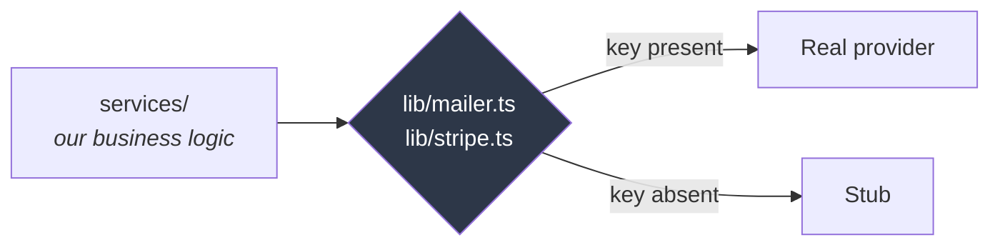

# Connecting the real services

Fakturly runs end to end without a Stripe or Resend account. Both have a
**stub** that behaves like the real thing from our side, so the whole payment
and email flow can be built and tested locally.

This document is the other half: what changes when you plug in real test
credentials, what to watch for, and why the code is shaped the way it is.

---

## The pattern, in one picture



**Nothing above `lib/` knows which mode it is in.** `payment.service.ts` calls
`createCheckoutSession()` and gets back a session; whether that came from
Stripe or from a stub is not its concern. That is the whole point of putting
the boundary there.

So switching on a real integration is a **configuration change, not a code
change**. If you ever find yourself editing a service to make a real
integration work, the seam is in the wrong place.

### The stubs are not "do nothing"

This matters more than it sounds.

| | The stub does |
|---|---|
| **Mailer** | Prints the full message, including the working link, to your console |
| **Stripe checkout** | Returns a session with a real-looking id and a URL |
| **Stripe webhook** | Signs and verifies with the **same HMAC-SHA256 scheme Stripe uses** |

That last one is deliberate. A stub that accepted any signature would leave
the single most important check in the payment flow untested until production.
Instead, `tests/integration/payments.test.ts` sends a **forged** signature and
a body **tampered with after signing**, and both are rejected — exercising the
real verification path.

### Production cannot run on stubs

`lib/env.ts` refuses to boot when `NODE_ENV=production` and the keys are
missing:

```
❌ Ogiltiga miljövariabler i backend/.env:

STRIPE_SECRET_KEY krävs i produktion — annars betalningar skulle tyst sluta fungera
```

A convenience that can ship by accident is not a convenience. This is what
stops the app deploying with payments silently disabled.

---

## Stripe

### 1. Get test-mode keys

Stripe dashboard → make sure the **Test mode** toggle is on → Developers → API keys.

```env
STRIPE_SECRET_KEY="sk_test_..."
```

> A `sk_test_` key can only ever touch test data. Cards never charge. The
> account is the same one you would use live, in a separate mode.
>
> **Never put an `sk_live_` key in `.env`.** CI has a job that fails the build
> if one is ever committed, but the first line of defence is not pasting it.

### 2. Get the webhook secret

The secret is **not** in the dashboard for local development — it comes from
the Stripe CLI, and it is different every time you start it.

```bash
brew install stripe/stripe-cli/stripe   # once
stripe login                            # once

stripe listen --forward-to localhost:3000/webhooks/stripe
```

It prints:

```
> Ready! Your webhook signing secret is whsec_abc123...
```

```env
STRIPE_WEBHOOK_SECRET="whsec_abc123..."
```

Restart the API — `env.ts` reads this once at boot, on purpose.

### 3. Try it

```bash
# issue an invoice, then:
curl -X POST localhost:3000/invoices/<id>/payment-link \
  -H "authorization: Bearer <admin token>"
```

You now get a real `https://checkout.stripe.com/...` URL instead of the stub
one. Open it and pay with Stripe's test card:

```
4242 4242 4242 4242   any future expiry   any CVC
```

The `stripe listen` terminal shows the event arriving, and the invoice becomes
`PAID`.

### What changes, precisely

| | Stub | Real |
|---|---|---|
| Checkout URL | `localhost:5173/stub-checkout?...` | `checkout.stripe.com/...` |
| Session id | `cs_stub_...` | `cs_test_...` |
| Webhook source | Your test, signed with the stub secret | Stripe, via `stripe listen` |
| Signature secret | `STUB_WEBHOOK_SECRET` in `lib/stripe.ts` | `STRIPE_WEBHOOK_SECRET` |
| Everything downstream | **identical** | **identical** |

### Things that will bite

**The raw body.** `routes/webhooks.routes.ts` registers its own content-type
parser so the body stays a string. Stripe signs the exact bytes it sent;
parsing to JSON and re-serialising changes key order and whitespace, and the
signature fails for reasons that look like a Stripe bug. If you ever see
"signature verification failed" against a secret you know is right, this is
almost always why.

**The API version is pinned** in `lib/stripe.ts`, and TypeScript enforces that
it matches the installed SDK. Bumping the SDK will fail the build until you
update the pin — which is exactly when to read Stripe's changelog rather than
after a behaviour change reaches production.

**`stripe listen` gives a new secret each run.** If webhooks suddenly stop
verifying, check that `.env` still matches the terminal.

**Test the retry behaviour.** `stripe trigger checkout.session.completed`
fires a real event. Run it twice: the second is rejected as a duplicate, and
`ProcessedWebhookEvent` is why.

---

## Resend

### 1. Get an API key

resend.com → API Keys → Create.

```env
RESEND_API_KEY="re_..."
EMAIL_FROM="Fakturly <onboarding@resend.dev>"
```

`onboarding@resend.dev` is Resend's shared sender and needs no domain setup —
but it **only delivers to the address that owns the account**. That is enough
to see a real invite email arrive.

### 2. To send to anyone else

Verify a domain: Resend → Domains → Add, then add the DNS records they give
you. Once verified:

```env
EMAIL_FROM="Fakturly <fakturor@dindomän.se>"
```

Set up **SPF** and **DKIM** at the same time — Resend walks you through both.
Without them, invoice emails land in spam, and an invoice nobody sees is an
invoice nobody pays.

### What changes

| | Stub | Real |
|---|---|---|
| Where it goes | Your terminal | An actual inbox |
| `EmailLog.providerMessageId` | `console-1786...` | Resend's id |
| Failure handling | Cannot fail | Recorded, never throws |

The `console-` prefix exists so a stub send can never be mistaken for a real
one when it turns up in an `EmailLog` row months later.

### The behaviour that does not change

A failed send **never** fails the operation that triggered it. Provisioning a
client whose invite email bounces still creates the client — the invite can be
resent, but rolling back a customer because a mail server was briefly down
would be absurd. The attempt is recorded either way, because "we emailed them"
is a claim that gets made in disputes.

---

## Verifying without any keys at all

This is worth doing before adding credentials, because it proves the flow
rather than the integration:

```bash
docker compose up -d
cd backend && bun run dev
```

```bash
# 1. provision a client — the invite email prints to the console,
#    link included
curl -X POST localhost:3000/clients \
  -H "authorization: Bearer <admin token>" \
  -H 'content-type: application/json' \
  -d '{"email":"kund@example.se","name":"Testkund AB"}'

# 2. copy the link's token, set a password
curl -X POST localhost:3000/auth/set-password \
  -H 'content-type: application/json' \
  -d '{"token":"<from console>","password":"en lång unik lösenordsfras"}'

# 3. that client can now log in
```

The whole invite flow, working, with no account anywhere.

---

## When you are ready to go live

Not yet — but so it is written down:

- [ ] Swap `sk_test_` for `sk_live_`, in a secret manager, **never in a file**
- [ ] Create a real webhook endpoint in the Stripe dashboard (not `stripe listen`) and use *its* signing secret
- [ ] Verify a sending domain, with SPF and DKIM
- [ ] Generate a real `JWT_SECRET` — `openssl rand -base64 48`
- [ ] Confirm `NODE_ENV=production`, so `env.ts` enforces all of the above
- [ ] Check the Riksbank **referensränta** in `lib/money.ts`; it changes twice a year

---

## Adding a third provider later

The shape to copy:

1. A `lib/<provider>.ts` that exports **our** types, not theirs
2. A real path and a stub path behind one function
3. A stub that behaves like the provider — including rejecting bad input
4. The key added to `env.ts`, and to the production requirement if the feature
   cannot work without it
5. Nothing above `lib/` importing the provider's SDK

Rule of thumb: **if a service file imports `stripe` or `resend` directly, the
seam is in the wrong place.**
